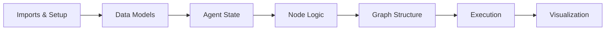

# AI Project Manager Agent

An autonomous AI agent that plans, schedules, and allocates resources for software projects. It uses LangGraph to orchestrate the workflow and a Groq-hosted LLM to reason about tasks, dependencies, team skills, and risks.

## Learning Objectives

By the end of this repository, you should be able to:

- Define structured data models with Pydantic to validate LLM output.
- Build a multi-step agent as a LangGraph state graph with nodes and shared state.
- Implement agent nodes that scope tasks, map dependencies, schedule work, allocate people, and audit risk.
- Apply an iterative loop so the agent revises its plan based on a risk assessment.
- Visualize a project schedule as an interactive Gantt chart with Plotly.

## Learning Path

The notebook walks through building the agent step by step. The modular version packages the same logic as a runnable application.



| File / Folder | Description |
|---|---|
| [**PM Assistant Notebook**](1_PM_assistant_v2_Llama.ipynb) | Interactive notebook that builds and runs the agent step by step. |
| [**Modular PM Agent**](modular_pm_agent/) | The same agent split into `models`, `state`, `nodes`, `graph`, and `visualization` modules, with `main.py` as the entry point. |

### Additional Folders and Files

| File / Folder | Description |
|---|---|
| [**Solutions**](solutions/) | Reference solutions. |
| [**Project Schedule**](project_schedule.html) | Example Gantt chart generated by the agent. |
| [**.env.example**](.env.example) | Template for your Groq API key. |
| [**pyproject.toml**](pyproject.toml) | Project configuration. |
| [**uv.lock**](uv.lock) | Dependency lock file. |

## Setup

> [!NOTE]
> Text in angle brackets like `<repo-name>` is a **placeholder**. Replace it, including the `< >` brackets, with your own value. For example, `cd <repo-name>` becomes `cd my-pm-agent`.

### 1. Create the Repository from the Template

Click **Use this template** on GitHub.

When creating the repository:

- Set yourself as the **Owner**
- Choose a repository name
- Disable **Include all branches**
- Click **Create repository**

---

### 2. Clone the Repository

Copy the SSH URL from the **Code** button on GitHub, then run:

```bash
git clone <copied-ssh-url>
```

The copied SSH URL will look like `git@github.com:<your-username>/<repo-name>.git`.

---

### 3. Move into the Project Folder and Install Dependencies

This installs all dependencies and creates a virtual environment in `.venv/`.

```bash
cd <repo-name>
uv sync
```

---

### 4. Add Your Groq API Key

The agent needs a Groq API key. Create a free key in the [Groq console](https://console.groq.com/keys), then copy the template and fill in the value:

```bash
cp .env.example .env
```

Open `.env` and replace `<your-groq-api-key>` with your key.

> [!CAUTION]
> `.env` holds secrets and must never be committed. Only `.env.example`, with placeholders, belongs in the repository.

---

### 5. Open the Notebook

> [!NOTE]
> Make sure you open VS Code from the project root so it automatically detects the environment created by `uv sync`.

Launch VS Code in the project root folder:

```bash
code .
```

Then open the notebook and select the Python environment created by `uv sync` as the kernel.

## Usage

To run the full autonomous agent:

```bash
uv run modular_pm_agent/main.py
```

The agent will:

1. **Scope:** Break down the project into granular tasks (Scoper Node).
2. **Map:** Identify dependencies between tasks (Mapper Node).
3. **Schedule:** Create a timeline and handle circular dependencies (Scheduler Node).
4. **Allocate:** Assign tasks to team members based on skills (Allocator Node).
5. **Audit:** Assess project risks (Auditor Node).
6. **Visualize:** Generate an interactive **Gantt Chart**.

**Output:** After a successful run, open the generated HTML file to see the schedule:

```bash
open project_schedule.html  # macOS
```

## References & Further Reading

- [**LangGraph Documentation**](https://docs.langchain.com/oss/python/langgraph/overview): Official guide to building stateful agents as graphs
- [**LangGraph on GitHub**](https://github.com/langchain-ai/langgraph): Source code and examples of the framework used here
- [**ChatGroq Integration**](https://docs.langchain.com/oss/python/integrations/chat/groq): How LangChain connects to Groq-hosted models
- [**Groq Documentation**](https://console.groq.com/docs/overview): API reference and the list of available models
- [**Pydantic Documentation**](https://docs.pydantic.dev/latest/): Data validation used for the structured LLM output
- [**Plotly Gantt Charts**](https://plotly.com/python/gantt/): Timeline charts like the one the agent generates
- [**uv Documentation**](https://docs.astral.sh/uv/): The package manager used in this repository
